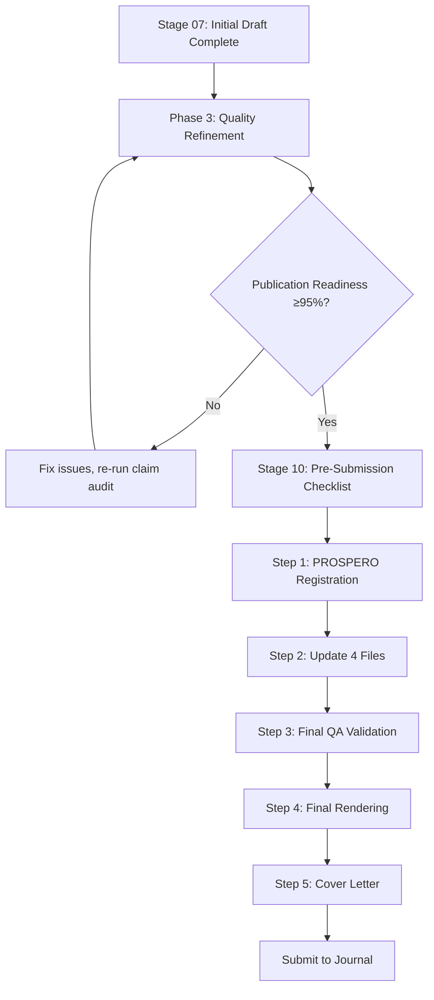

# ma-submission-prep

**Final submission preparation checklists and templates for meta-analysis manuscripts**

---

## Purpose

This module provides **human-oriented checklists and templates** for the final 1-2 hours before journal submission. It bridges the gap between automated QA tools (`ma-publication-quality`) and actual submission.

**Scope**: Stage 10 (Pre-Submission) workflows, covering:
- Phase 3 Quality Refinement (90% → 95-98% readiness)
- PROSPERO registration
- Journal-specific materials
- Cover letter templates
- Session resumption guides

---

## Module Structure (Progressive Disclosure Architecture)

**3-Tier Design**: Quickcards (Tier 1) → Checklists (Tier 2) → Reference Guides (Tier 3)

```
ma-submission-prep/
├── README.md                                    # This file
├── assets/
│   ├── quickcards/                              # ⭐ TIER 1 (Start here - 1 page)
│   │   ├── phase3-quickcard.md                  # ✅ 20-30 lines, 5 checkboxes
│   │   └── stage10-quickcard.md                 # ✅ 20-30 lines, 5 steps
│   ├── checklists/                              # TIER 2 (Execution - detailed actions)
│   │   ├── phase3-checklist.md                  # ✅ 230 lines (refactored from 256)
│   │   ├── stage10-checklist.md                 # ✅ 310 lines (step-by-step)
│   │   └── visual-qa-checklist.md               # 🚧 TODO
│   └── templates/                               # Templates (copy & customize)
│       ├── next-steps-template.md               # ✅ Session resumption
│       ├── clinical-scenario-template.md        # ✅ Scenario structure
│       ├── cover-letter-jama.md                 # 🚧 TODO
│       ├── cover-letter-lancet.md               # 🚧 TODO
│       ├── cover-letter-nature.md               # 🚧 TODO
│       ├── key-points-box.md                    # 🚧 TODO
│       └── research-in-context.md               # 🚧 TODO
└── references/                                  # ⭐ TIER 3 (Deep learning - examples, anti-patterns)
    ├── clinical-implications-guide.md           # ✅ 10-15 min read, examples, anti-patterns
    ├── overclaim-prevention-guide.md            # ✅ 8-10 min read, 12 patterns
    ├── hypothesis-resolution-guide.md           # ✅ 5 min placeholder (TODO: expand)
    ├── journal-materials-guide.md               # ✅ 5 min placeholder (TODO: expand)
    ├── transitivity-guide.md                    # ✅ 5 min placeholder (TODO: expand)
    ├── prospero-registration-guide.md           # 🚧 TODO
    ├── cover-letter-guide.md                    # 🚧 TODO
    ├── lessons-repository.md                    # 🚧 TODO (extract from early-immuno-timing-nma)
    └── anti-patterns.md                         # 🚧 TODO (consolidate from guides)
```

**Legend**:
- ✅ **Complete** - Ready to use
- 🚧 **TODO** - Placeholder (to be expanded in future versions)

---

## Quick Start (Progressive Disclosure Workflow)

### **Scenario 1: Manuscript at 90%, need final polish**

**Action**: Execute Phase 3 Quality Refinement

**Step 1**: Start with Quickcard (5 seconds to see what to do)
```bash
open ma-submission-prep/assets/quickcards/phase3-quickcard.md
```
**What you see**: 5 checkboxes (20-30 lines), pass criteria, time estimates

**Step 2**: If familiar with process, execute directly using checklist
```bash
open ma-submission-prep/assets/checklists/phase3-checklist.md
```
**What you see**: Detailed actions, pass criteria, tools to use (links to Tier 3 guides)

**Step 3**: If need examples/anti-patterns, click through to reference guides
```bash
# Example: For Step 1 (Clinical Implications)
open ma-submission-prep/references/clinical-implications-guide.md
```
**What you see**: Why it matters, step-by-step, examples from early-immuno-timing-nma, anti-patterns to avoid

**Time**: 2-3 hours | **ROI**: +10% acceptance rate, prevents 6-12 month revision delays

---

### **Scenario 2: Ready to submit, need final checklist**

**Action**: Execute Stage 10 Pre-Submission workflow

**Step 1**: Start with Quickcard (5 seconds)
```bash
open ma-submission-prep/assets/quickcards/stage10-quickcard.md
```
**What you see**: 5 steps (PROSPERO → Update files → QA → Render → Cover Letter), submission package checklist

**Step 2**: Execute using detailed checklist
```bash
open ma-submission-prep/assets/checklists/stage10-checklist.md
```
**What you see**: Step-by-step instructions, PROSPERO quick-fill guide, verification commands, troubleshooting

**Step 3**: If need templates, use assets/templates/
```bash
# Copy Next Steps template (for session resumption)
cp ma-submission-prep/assets/templates/next-steps-template.md projects/<project-name>/NEXT_STEPS_$(date +%Y-%m-%d).md

# Use clinical scenario template (for Phase 3 Step 1)
open ma-submission-prep/assets/templates/clinical-scenario-template.md
```

**Time**: 1-2 hours

---

### **Scenario 3: Ending session, need resumption guide**

**Action**: Create Next Steps file

```bash
# Copy template to project root
cp ma-submission-prep/assets/templates/next-steps-template.md \
   projects/<project-name>/NEXT_STEPS_$(date +%Y-%m-%d).md

# Edit with session details
open projects/<project-name>/NEXT_STEPS_*.md
```

---

## Key Files

### **Checklists** (Human-oriented, track progress)

| File | Purpose | When to Use |
|------|---------|-------------|
| `phase3-checklist.md` | 5-item quality refinement checklist | After initial draft complete (`make docx` works) |
| `stage10-checklist.md` | 5-step pre-submission checklist | Manuscript at 95%+, planning submission 1-2 days |
| `visual-qa-checklist.md` | Final Word document QA | Before uploading to journal portal |

### **Templates** (Copy & customize)

| File | Purpose | Customization Needed |
|------|---------|---------------------|
| `next-steps-template.md` | Session resumption guide | Fill completed tasks, next actions, time estimates |
| `cover-letter-jama.md` | JAMA Oncology cover letter | Replace `[TITLE]`, `[N]`, `[PRIMARY FINDING]` placeholders |
| `cover-letter-lancet.md` | Lancet Oncology cover letter | Emphasize global health impact, novelty |
| `key-points-box.md` | JAMA Key Points box template | ≤350 words, Question-Findings-Meaning structure |
| `research-in-context.md` | Lancet Research in Context | ~450 words, 3-section structure |

### **Reference Guides** (Read for understanding)

| File | Purpose | Reading Time |
|------|---------|--------------|
| `phase3-quality-refinement.md` | Detailed Phase 3 workflow | 10 min |
| `prospero-registration-guide.md` | PROSPERO fill guide with examples | 5 min |
| `journal-materials-guide.md` | Journal-specific requirements | 10 min |
| `lessons-repository.md` | Success factors + anti-patterns | 15 min |

---

## Integration with Other Modules

| Module | Relationship |
|--------|--------------|
| `ma-publication-quality/` | **Automated QA tools** (claim_audit.py, crossref_check.py) → Feed into Phase 3 refinement |
| `ma-end-to-end/` | **Pipeline orchestration** → Calls Stage 10 after Stage 09 QA passes |
| `ma-manuscript-quarto/` | **Draft generation** → Phase 3 refines the draft to 95-98% |
| `ma-network-meta-analysis/` | **NMA-specific QA** → Transitivity assessment feeds into Phase 3 item #5 |

---

## Workflow Integration



---

## Design Principles

1. **Human-oriented**: Checklists designed for manual review, not automation
2. **Time-bounded**: Every workflow has clear time estimates (30 min, 1-2 hours)
3. **Evidence-based**: All templates/checklists validated in real projects (early-immuno-timing-nma)
4. **Journal-specific**: Separate materials for JAMA/Lancet/Nature Medicine
5. **Progressive disclosure**: Quick start → Checklists → Detailed guides

---

## Version History

| Version | Date | Changes |
|---------|------|---------|
| 1.0.0 | 2026-02-17 | Initial release (extracted from early-immuno-timing-nma project) |

---

## Contributing

When adding new templates/checklists:

1. **Validate in real project** (≥1 completed meta-analysis)
2. **Add to lessons-repository.md** (success factors or anti-patterns)
3. **Update this README** (add to Quick Start or Key Files table)
4. **Link from CLAUDE.md** (if workflow-critical)

---

## License

MIT License - Templates may be freely adapted for your own meta-analysis projects.
