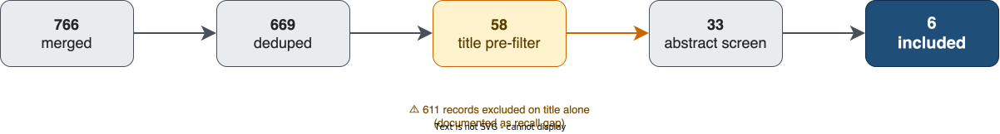
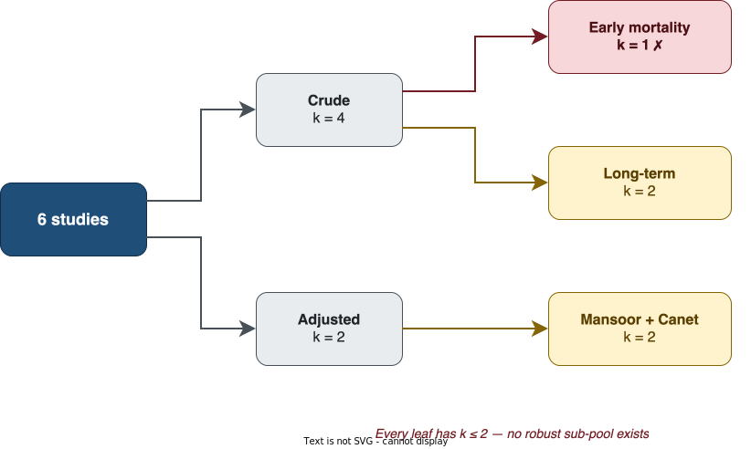
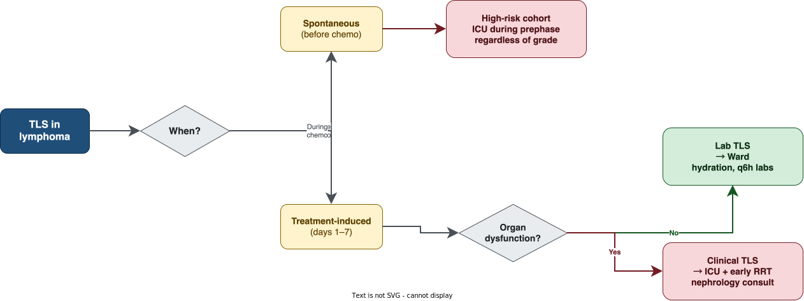

## Today's question {.center}

::: {.takehome}
**My Burkitt patient just developed laboratory tumor lysis syndrome on day 2 of chemotherapy.**

**Should I be worried?**
:::

. . .

- Rapid evidence synthesis
- **6 comparative cohorts · 857 lymphoma patients · 223 with TLS**
- Pooled estimate · GRADE · clinical bedside summary
- 5 minutes · 10 slides · all artifacts on GitHub

::: {.notes}
Today, a 5-minute walk through whether tumor lysis syndrome at presentation in lymphoma patients actually predicts worse outcome — and what that means at the bedside. Six cohorts, 857 patients, one number, and a few important caveats.
:::

---

## Why this question — Background {background-color="#f5f9ff"}

- **TLS is an oncologic emergency** — well known, well managed (Cairo–Bishop 2004; Howard 2011; Bociek & Lunning *NEJM* 2025)
- **Incidence is well described** in every textbook; **prognostic effect has never been pooled**
- **Strong administrative-data signal**: NHL + TLS in-hospital mortality **28.3 % vs 5.1 %** without TLS (NIS 2019–2020, adjusted OR **7.3**)¹
- Existing reviews focus on drug-specific TLS (venetoclax, TKIs), management algorithms, single-disease cohorts — **not on TLS as a prognostic marker in lymphoma**

::: {.takehome .small}
**Gap**: No published meta-analysis of *comparative cohort* studies answers *"Does TLS at presentation independently mark a higher-mortality lymphoma patient?"*
:::

::: {.tiny}
¹ NIS 2019–2020 analysis, *J Clin Oncol* 2024 suppl 16, abstr e19032
:::

::: {.notes}
We have lots of papers on TLS incidence and management, including a 2025 NEJM review. But none had pooled the comparative cohort evidence. The administrative data already hints at a large effect — NHL patients with TLS have 28% in-hospital mortality versus 5% without, adjusted OR 7.3 in the most recent NIS analysis. That's the backdrop against which our cohort meta-analysis sits, and it suggests we should be on the lookout for a signal.
:::

---

## What we did — Methods {background-color="#f5f9ff"}

::: {.small}
- **Search**: PubMed + Scopus, inception → 10 April 2026
- **Pipeline**: 766 records → 669 deduped → 33 PubMed-screened → 6 included
  - Plus post-hoc Scopus enrichment (CrossRef + OpenAlex) → 1 more (Sall 2026)
- **Eligibility**: comparative cohort, lymphoma, TLS-stratified mortality
- **Synthesis**: random-effects pool, DerSimonian–Laird, **HKSJ correction** (k < 10)
- **Risk of bias**: QUIPS (single rater)
:::

::: {.callout-warning .small}
**Honest framing**: This is a **rapid evidence synthesis**, not a full systematic review. Single-AI screening, no PROSPERO, two databases. Use as hypothesis-generating, not as a guideline source.
:::

::: {.notes}
We did a rapid review — PubMed and Scopus, single-AI screening, six final studies. Importantly: rapid, not systematic. We're explicit about that limitation up front.
:::

---

## From search to synthesis — 766 → 6 {background-color="#f5f9ff"}

::: {.columns}

::: {.column width="36%"}

**Five filtering steps**

::: {.small}
1. Merge two databases
2. DOI + fuzzy title dedupe
3. Title pre-filter ⚠️
4. AI abstract screen
5. Full-text eligibility
:::

::: {.tiny}
Step 3 is the non-standard one — 611 records excluded on title alone. Recall gap, documented in limitations.
:::

:::

::: {.column width="64%"}

{fig-align="center" width="100%"}

:::

:::

::: {.notes}
Five filtering steps from 766 to 6. The orange step — the title pre-filter — is the non-standard one. It excluded 611 records on title alone, which is the single biggest recall risk in the rapid review. Everything else in blue passed a normal screening pipeline.
:::

---

## Six studies, four decades, four continents

::: {.small}

| Study | Country | Population | n | TLS+ | Effect (95 % CI) |
|---|---|---|---|---|---|
| **Mansoor 2019** | Pakistan | Pediatric B-NHL (Burkitt 69 %) | 233 | 48 | aOR **7.84 (3.16–19.4)** |
| **Canet 2013** | France ICU (multi) | Adult heme (lymphoma 42 %) | 153 | 47 | aOR **2.45 (1.09–5.50)** |
| **Zeng 2024** | China | Pediatric HG B-NHL R3/R4 | 283 | 76 | OR **2.43 (1.17–5.08)** |
| **Bozkurt 2024** | Turkey | Pediatric NHL (Burkitt 75 %) | 107 | 33 | OR **1.56 (0.41–5.93)** |
| **Lin 2020** | Taiwan | HIV-NHL adult | 22 | 5 | OR **11.30 (1.10–115)** |
| Alavi 2006 *(sensitivity)* | Iran | Pediatric NHL | 59 | 14 | OR 24.4 (1.18–506) |

:::

::: {.tiny}
Point estimates span **OR 1.6 to 24** — a clue that "TLS at presentation" is not one biological entity.
:::

::: {.notes}
Six cohorts. Four pediatric Burkitt-dominant, two adult, one HIV-NHL. Effect sizes range from 1.6 to 24 — already a clue that "TLS at presentation" is not one disease, but several biologically distinct patterns the literature has been treating as one.
:::

---

## Headline result — Pool F minus Alavi (k = 5) {background-color="#fafafa"}

{fig-align="center" width="85%"}

::: {.takehome}
**OR 3.31 (95 % CI 1.37 – 7.98), p = 0.020, I² = 42 %**

Across the five studies we are willing to defend on their own merits, **TLS at presentation triples the odds of mortality** in lymphoma patients.
:::

::: {.notes}
Across the five studies we are willing to defend on their own merits, TLS at presentation triples the odds of mortality. The confidence interval runs from 1.4 to 8 — wide, but uniformly above 1. The direction of effect is consistent in five of six studies.
:::

---

## Why one number isn't enough {background-color="#fff7e6"}

::: {.columns}

::: {.column width="38%"}

**Stratify by adjustment × time window**

Every leaf is **k ≤ 2**.

The OR 3.3 only exists when we average methodologically heterogeneous studies together.

::: {.tiny}
→ no sub-pool is statistically robust on its own
:::

:::

::: {.column width="62%"}

{fig-align="center" width="100%"}

:::

:::

::: {.notes}
Here is the fragility visually. Start with six studies, split by adjustment status on top level, then split by mortality time window on the next. Every leaf has k equals one or two. The crude-and-early-mortality leaf — the one we intended as our primary analysis — contains only Lin 2020. That's the red box. The other two leaves each have two studies. No sub-pool is statistically robust on its own.
:::

---

## The catch: this number is fragile {background-color="#fff7e6"}

- Stratify the 6 studies by **adjustment status × mortality time window** →
  - **No sub-pool contains more than 2 studies**
  - The "intended" primary pool (crude × early mortality) = **k = 1** (Lin 2020 only)
- The pooled OR ~3 emerges **only by averaging studies with different definitions**

::: {.callout-warning}
**GRADE-prognostic certainty: VERY LOW**

- Downgraded for inconsistency (I² 42 %, magnitude varies 1.6–7.8)
- Downgraded for indirectness (mixed time windows, mixed adjustment)
- Downgraded for imprecision (k = 5, wide CI)
- **No "+1 large effect" upgrade** — confounding cannot be excluded
:::

::: {.notes}
Here is the catch. The moment you slice the data by adjustment status or by mortality time window, no sub-pool has more than two studies. The 3-fold figure exists only because we averaged methodologically different studies. The GRADE certainty rating, as a result, is very low. This is a real result but it should motivate research, not dictate practice.
:::

---

## Spontaneous vs treatment-induced — *different diseases* {background-color="#f5f9ff"}

::: {.columns}

::: {.column width="48%"}

### 🚨 Spontaneous TLS
**At admission, before any chemotherapy**

- Marker of **overwhelming tumor burden**; body failing before treatment begins
- Listed as a specific risk factor in **NCCN B-cell & T-cell Lymphoma guidelines**

**Effect estimates**:

- Pediatric LMIC Burkitt — aOR **7.8**
- HIV-NHL — OR **11.3**
- **Abdel-Nabey 2022** (ICU cohort n = 153): spontaneous TLS independently predicts 1-year mortality, **adjusted HR 1.65 (1.01–2.69)**¹

→ **High-mortality cohort**

:::

::: {.column width="48%"}

### 💊 Treatment-induced TLS
**Days 1–7 of induction chemotherapy**

- Hypothesis: marker of **chemosensitivity** — tumor is responding violently
- Indirect support: rasburicase use (proxy for severe lysis) **improved** 1-year remission HR 2.45 (1.17–5.15)¹

**Effect estimates**:

- Bozkurt 2024 — OR **1.6** (NS)
- Sall 2026 — log-rank **p = 0.7** (null)
- Zeng 2024 — *higher* uric acid at TLS onset → **better** survival

→ **Often a transient bump**

:::

:::

::: {.tiny}
¹ Abdel-Nabey et al., *Ann Intensive Care* 2022 — n=153 critically-ill TLS patients, multivariable Cox
:::

::: {.notes}
This is the most clinically useful distinction, and it is hidden inside the pooled estimate. Spontaneous TLS — the patient who walks into the ER already lysing — is a high-mortality cohort. Abdel-Nabey's ICU cohort from 2022 showed spontaneous TLS independently predicts 1-year mortality with a hazard ratio of 1.65. Treatment-induced TLS during R-CHOP day 2 is often a marker that the chemotherapy is working, and the same Abdel-Nabey paper found that rasburicase use — a proxy for severe lysis — was associated with better 1-year remission. Don't conflate the two.
:::

---

## Bedside decision pathway {background-color="#f5f9ff"}

::: {.columns}

::: {.column width="34%"}

**Two questions decide everything**

1. **When** did TLS appear?
2. Is there **organ dysfunction**?

::: {.tiny}
Everything downstream — ward vs ICU, timing of rasburicase, chemotherapy delay — follows from these two answers.
:::

:::

::: {.column width="66%"}

{fig-align="center" width="100%"}

:::

:::

::: {.notes}
Two questions decide everything at the bedside. First, when did TLS appear — spontaneous, before any chemotherapy, means high-mortality cohort, ICU-level care during prephase. Treatment-induced, during induction days one through seven, the next question is organ dysfunction. No dysfunction is laboratory TLS, manage on the ward per ASCO and NCCN. Yes dysfunction is clinical TLS, ICU threshold low, early renal replacement therapy. Red boxes are the ones that need the ICU, green is the one that doesn't.
:::

---

## Bedside summary 📸 {background-color="#f5f9ff"}

::: {.small}

| Clinical scenario | Action | Evidence |
|---|---|---|
| **Adult DLBCL + lab TLS** (no organ dysfunction) on R-CHOP days 1–3 | Continue treatment, hydrate 1–3 L/m²/day (UOP ≥ 2 mL/kg/hr), allopurinol ± rasburicase, **q 6 h labs + telemetry**. **No automatic ICU.** | Coiffier/Cairo *JCO* 2008; NCCN B-cell; NEJM 2025 ¹. **Montesinos AML n=614: LTLS mortality 21 % vs 24 % without TLS (NS); CTLS mortality 83 %** ² |
| **Adult lymphoma + clinical TLS** (Cr ≥ 1.5× ULN, arrhythmia, seizure) | Rapid nephrology, **low ICU threshold**, rasburicase, early RRT | Coiffier *JCO* 2008; NEJM 2025; **83 % CTLS mortality** signal ² |
| **Spontaneous TLS at presentation** (Burkitt / HIV-NHL / bulky DLBCL with renal involvement) | **High-mortality cohort.** Consider ICU during cytoreductive prephase **regardless of TLS grade** | Abdel-Nabey 2022: spontaneous TLS **HR 1.65 (1.01–2.69)** ³; NCCN lists as specific risk factor |
| **Pediatric Burkitt, any setting** | High TLS risk; rasburicase prophylaxis; aggressive supportive care | Mansoor 2019 aOR **7.8**; Cairo 2010; NCCN pediatric |

:::

::: {.tiny}
¹ Bociek & Lunning, *NEJM* 2025 · ² Montesinos et al., cited in Coiffier *JCO* 2008 · ³ Abdel-Nabey et al., *Ann Intensive Care* 2022

*Clinical-judgment statements grounded in **very-low-certainty** pooled evidence + guideline support. Local protocols and individual patient factors should override.*
:::

::: {.notes}
Take a photo of this slide. Four scenarios, each now with a specific evidence source. The top row — adult DLBCL with lab TLS on R-CHOP day 2 — is the one that comes up most often in clinic. Montesinos' 614-patient AML cohort shows laboratory TLS carries no excess mortality versus no TLS at all, while clinical TLS carried 83% mortality. DLBCL is classified by ASCO as intermediate-risk, not high-risk like Burkitt. The answer is don't panic, manage on the ward. The third row — spontaneous TLS in a chemonaive patient — is the one to worry about, and Abdel-Nabey's adjusted hazard ratio of 1.65 supports treating this as a distinct high-mortality cohort.
:::

---

## What this synthesis does **not** cover

::: {.callout-warning}

This pool excludes — for newer-therapy TLS, see **Bociek & Lunning, *NEJM* 2025;393(11):1104–16**:

- **Immune checkpoint inhibitor TLS** (rare but distinct mechanism)
- **CAR-T cell therapy TLS** (CRS overlap)
- **BCL-2 inhibitor / venetoclax TLS** (ramp-up dosing strategies)
- **Bispecific T-cell engager TLS** (emerging signal)

:::

Plus the deferred remediation queue:

- Embase + Cochrane CENTRAL searches
- Dual-reviewer screening on the full 669-record corpus
- Citation chasing of all included studies
- Wössmann 2003 NHL-BFM, MD Anderson rasburicase series, Howard 2011 panel cohorts

::: {.notes}
One slide of honest disclaimers. We did not touch immune checkpoint inhibitors, CAR-T, venetoclax, or bispecific antibodies — different mechanisms, different evidence base, different review needed. The 2025 NEJM review by Bociek and Lunning covers those. Several large historical cohorts including the BFM trials are also missing, queued for the proper systematic review pass.
:::

---

## Take-home {background-color="#f5f9ff"}

::: {.takehome}
1. **TLS at presentation probably triples mortality odds in lymphoma** — pooled OR 3.31 (1.37–7.98), but the magnitude is uncertain
2. The clinically important split is **spontaneous vs treatment-induced** — same label, different diseases
3. **GRADE certainty is VERY LOW** — motivates research, doesn't direct practice
4. Risk-stratified management beats categorical recommendations
:::

. . .

::: {.center}
**📂 github.com/htlin222/lymphoma-TLS-outcome**

*Manuscript · R code · screening decisions · two rounds of peer review · all artifacts*
:::

::: {.notes}
Three take-homes. TLS at presentation is a marker, not a death sentence. The spontaneous-vs-treatment-induced distinction matters more than the pooled OR. Every artifact — manuscript, R code, reviewer reports, even the design-issue backlog — is in the public repo. Thank you.
:::

---

## Acknowledgements & disclosures {.smaller}

- **AI-assisted meta-analysis pipeline** — see project repository for full audit trail
- Two rounds of peer review (6 simulated reviewers, statistical / clinical / SR-methodology / editorial / clinician end-user)
- All extracted data, R analysis scripts, and reviewer reports are publicly available

**Disclosures**: No funding. No conflicts of interest. This is a rapid evidence synthesis and should not be cited as a systematic review.

**Live slides**: [htlin222.github.io/lymphoma-TLS-outcome](https://htlin222.github.io/lymphoma-TLS-outcome/)

::: {.notes}
Thanks to the peer review process — six simulated reviewers across two rounds caught the over-claims and the methodological gaps. Everything is open. Questions?
:::
