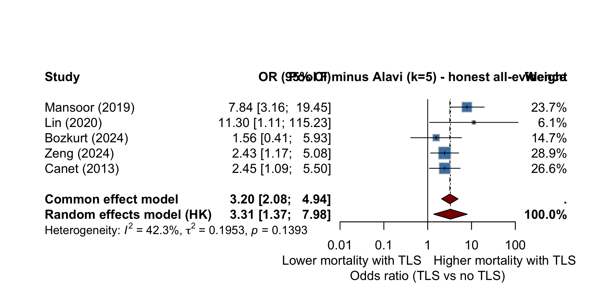

## Today's question {.center}

::: {.takehome}
**My Burkitt patient just developed laboratory tumor lysis syndrome on day 2 of chemotherapy.**

**Should I be worried?**
:::

. . .

- Rapid evidence synthesis
- **6 comparative cohorts · 857 lymphoma patients · 223 with TLS**
- Pooled estimate · GRADE · clinical bedside summary
- 5 minutes · 10 slides · all artifacts on GitHub

::: {.notes}
Today, a 5-minute walk through whether tumor lysis syndrome at presentation in lymphoma patients actually predicts worse outcome — and what that means at the bedside. Six cohorts, 857 patients, one number, and a few important caveats.
:::

---

## Why this question — Background {background-color="#f5f9ff"}

- **TLS is an oncologic emergency in lymphoma** — well known, well managed
- **Incidence is well described** — Cairo–Bishop, Howard, every textbook
- But **the prognostic effect of TLS itself has never been pooled**
- Existing reviews focus on: drug-specific TLS (venetoclax, TKIs), management algorithms, single-disease cohorts

::: {.takehome .small}
**Gap**: No published meta-analysis answers *"Does TLS at presentation independently mark a higher-mortality lymphoma patient?"*
:::

::: {.notes}
We have lots of papers on TLS incidence and management. None had ever pooled the comparative cohort evidence on whether TLS itself predicts mortality. That's the gap we tried to fill.
:::

---

## What we did — Methods {background-color="#f5f9ff"}

::: {.small}
- **Search**: PubMed + Scopus, inception → 10 April 2026
- **Pipeline**: 766 records → 669 deduped → 33 PubMed-screened → 6 included
  - Plus post-hoc Scopus enrichment (CrossRef + OpenAlex) → 1 more (Sall 2026)
- **Eligibility**: comparative cohort, lymphoma, TLS-stratified mortality
- **Synthesis**: random-effects pool, DerSimonian–Laird, **HKSJ correction** (k < 10)
- **Risk of bias**: QUIPS (single rater)
:::

::: {.callout-warning .small}
**Honest framing**: This is a **rapid evidence synthesis**, not a full systematic review. Single-AI screening, no PROSPERO, two databases. Use as hypothesis-generating, not as a guideline source.
:::

::: {.notes}
We did a rapid review — PubMed and Scopus, single-AI screening, six final studies. Importantly: rapid, not systematic. We're explicit about that limitation up front.
:::

---

## Six studies, four decades, four continents

::: {.small}

| Study | Country | Population | n | TLS+ | Effect (95 % CI) |
|---|---|---|---|---|---|
| **Mansoor 2019** | Pakistan | Pediatric B-NHL (Burkitt 69 %) | 233 | 48 | aOR **7.84 (3.16–19.4)** |
| **Canet 2013** | France ICU (multi) | Adult heme (lymphoma 42 %) | 153 | 47 | aOR **2.45 (1.09–5.50)** |
| **Zeng 2024** | China | Pediatric HG B-NHL R3/R4 | 283 | 76 | OR **2.43 (1.17–5.08)** |
| **Bozkurt 2024** | Turkey | Pediatric NHL (Burkitt 75 %) | 107 | 33 | OR **1.56 (0.41–5.93)** |
| **Lin 2020** | Taiwan | HIV-NHL adult | 22 | 5 | OR **11.30 (1.10–115)** |
| Alavi 2006 *(sensitivity)* | Iran | Pediatric NHL | 59 | 14 | OR 24.4 (1.18–506) |

:::

::: {.tiny}
Point estimates span **OR 1.6 to 24** — a clue that "TLS at presentation" is not one biological entity.
:::

::: {.notes}
Six cohorts. Four pediatric Burkitt-dominant, two adult, one HIV-NHL. Effect sizes range from 1.6 to 24 — already a clue that "TLS at presentation" is not one disease, but several biologically distinct patterns the literature has been treating as one.
:::

---

## Headline result — Pool F minus Alavi (k = 5) {background-color="#fafafa"}

{fig-align="center" width="85%"}

::: {.takehome}
**OR 3.31 (95 % CI 1.37 – 7.98), p = 0.020, I² = 42 %**

Across the five studies we are willing to defend on their own merits, **TLS at presentation triples the odds of mortality** in lymphoma patients.
:::

::: {.notes}
Across the five studies we are willing to defend on their own merits, TLS at presentation triples the odds of mortality. The confidence interval runs from 1.4 to 8 — wide, but uniformly above 1. The direction of effect is consistent in five of six studies.
:::

---

## The catch: this number is fragile {background-color="#fff7e6"}

- Stratify the 6 studies by **adjustment status × mortality time window** →
  - **No sub-pool contains more than 2 studies**
  - The "intended" primary pool (crude × early mortality) = **k = 1** (Lin 2020 only)
- The pooled OR ~3 emerges **only by averaging studies with different definitions**

::: {.callout-warning}
**GRADE-prognostic certainty: VERY LOW**

- Downgraded for inconsistency (I² 42 %, magnitude varies 1.6–7.8)
- Downgraded for indirectness (mixed time windows, mixed adjustment)
- Downgraded for imprecision (k = 5, wide CI)
- **No "+1 large effect" upgrade** — confounding cannot be excluded
:::

::: {.notes}
Here is the catch. The moment you slice the data by adjustment status or by mortality time window, no sub-pool has more than two studies. The 3-fold figure exists only because we averaged methodologically different studies. The GRADE certainty rating, as a result, is very low. This is a real result but it should motivate research, not dictate practice.
:::

---

## Spontaneous vs treatment-induced — *different diseases* {background-color="#f5f9ff"}

::: {.columns}

::: {.column width="48%"}

### 🚨 Spontaneous TLS
**At admission, before any chemotherapy**

- Marker of **overwhelming tumor burden**
- The body is failing before treatment can start

**Effect estimates**:

- Pediatric LMIC Burkitt — aOR **7.8**
- HIV-NHL — OR **11.3**

→ **High-mortality cohort**

:::

::: {.column width="48%"}

### 💊 Treatment-induced TLS
**Days 1–7 of induction chemotherapy**

- Marker of **chemosensitivity**
- The tumor is responding violently

**Effect estimates**:

- Bozkurt 2024 — OR **1.6** (NS)
- Sall 2026 — log-rank **p = 0.7** (null)
- Zeng 2024 — *higher* uric acid → *better* survival

→ **Often a transient bump**

:::

:::

::: {.notes}
This is the most clinically useful distinction, and it is hidden inside the pooled estimate. Spontaneous TLS — the patient who walks into the ER already lysing — is a high-mortality cohort and the effect estimates are large. Treatment-induced TLS during R-CHOP day 2 is often a marker that the chemotherapy is working, and the effect estimates are small or null. Don't conflate them.
:::

---

## Bedside summary 📸 {background-color="#f5f9ff"}

::: {.small}

| Clinical scenario | Action |
|---|---|
| **Adult DLBCL + lab TLS on R-CHOP days 1–3** | Continue treatment, hydrate, allopurinol, recheck labs q6h. **No automatic ICU.** |
| **Adult lymphoma + clinical TLS** (Cr ≥ 1.5× ULN, arrhythmia, seizure) | Rapid nephrology, low ICU threshold, rasburicase, early RRT |
| **Spontaneous TLS at presentation** (Burkitt / HIV-NHL / bulky DLBCL) | **High-mortality cohort.** Consider ICU during cytoreductive prephase regardless of clinical TLS grade |
| **Pediatric Burkitt, any setting** | High TLS risk; rasburicase prophylaxis; aggressive supportive care |

:::

::: {.tiny}
*Clinical-judgment statements grounded in **very-low-certainty** evidence. Local guidelines and individual patient factors should override.*
:::

::: {.notes}
Take a photo of this slide. Four scenarios. The top one — adult DLBCL with lab TLS on R-CHOP day 2 — is the one that comes up most often in clinic, and the answer is don't panic, manage on the ward. The third row — spontaneous TLS in a chemonaive patient — is the one to worry about.
:::

---

## What this synthesis does **not** cover

::: {.callout-warning}

This pool excludes — and clinicians should expect a separate review for —

- **Immune checkpoint inhibitor TLS** (rare but distinct mechanism)
- **CAR-T cell therapy TLS** (CRS overlap)
- **BCL-2 inhibitor / venetoclax TLS** (ramp-up dosing strategies)
- **Bispecific T-cell engager TLS** (emerging signal)

:::

Plus the deferred remediation queue:

- Embase + Cochrane CENTRAL searches
- Dual-reviewer screening on the full 669-record corpus
- Citation chasing of all included studies
- Wössmann 2003 NHL-BFM, MD Anderson rasburicase series, Howard 2011 panel cohorts

::: {.notes}
One slide of honest disclaimers. We did not touch immune checkpoint inhibitors, CAR-T, venetoclax, or bispecific antibodies — different mechanisms, different evidence base, different review needed. And several large historical cohorts including the BFM trials are missing, queued for the proper systematic review pass.
:::

---

## Take-home {background-color="#f5f9ff"}

::: {.takehome}
1. **TLS at presentation probably triples mortality odds in lymphoma** — pooled OR 3.31 (1.37–7.98), but the magnitude is uncertain
2. The clinically important split is **spontaneous vs treatment-induced** — same label, different diseases
3. **GRADE certainty is VERY LOW** — motivates research, doesn't direct practice
4. Risk-stratified management beats categorical recommendations
:::

. . .

::: {.center}
**📂 github.com/htlin222/lymphoma-TLS-outcome**

*Manuscript · R code · screening decisions · two rounds of peer review · all artifacts*
:::

::: {.notes}
Three take-homes. TLS at presentation is a marker, not a death sentence. The spontaneous-vs-treatment-induced distinction matters more than the pooled OR. Every artifact — manuscript, R code, reviewer reports, even the design-issue backlog — is in the public repo. Thank you.
:::

---

## Acknowledgements & disclosures {.smaller}

- **AI-assisted meta-analysis pipeline** — see project repository for full audit trail
- Two rounds of peer review (6 simulated reviewers, statistical / clinical / SR-methodology / editorial / clinician end-user)
- All extracted data, R analysis scripts, and reviewer reports are publicly available

**Disclosures**: No funding. No conflicts of interest. This is a rapid evidence synthesis and should not be cited as a systematic review.

**Live slides**: [htlin222.github.io/lymphoma-TLS-outcome](https://htlin222.github.io/lymphoma-TLS-outcome/)

::: {.notes}
Thanks to the peer review process — six simulated reviewers across two rounds caught the over-claims and the methodological gaps. Everything is open. Questions?
:::
